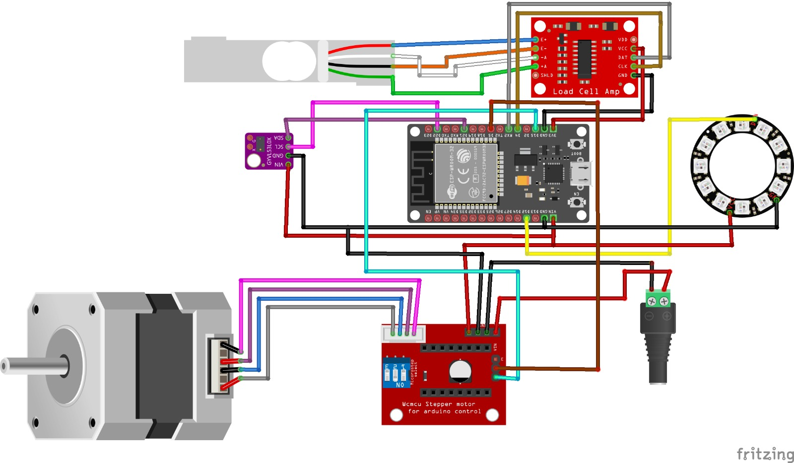
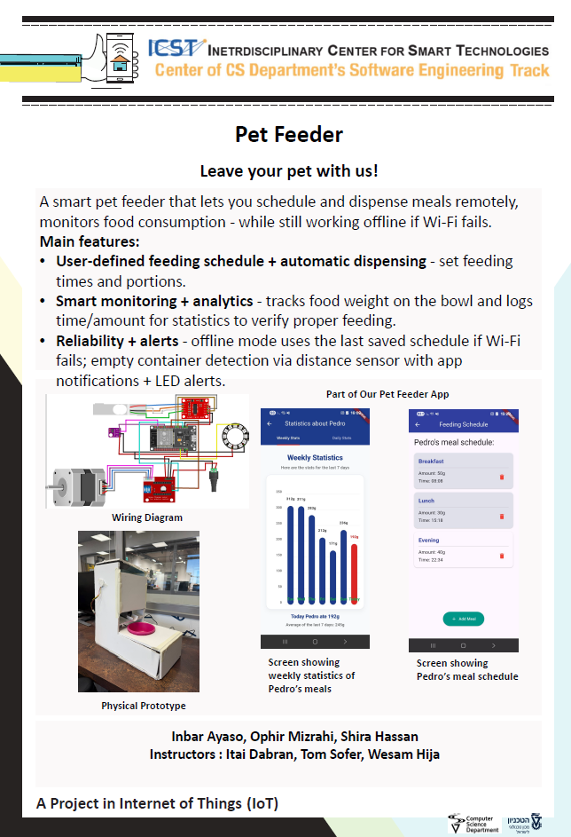

## Pet Feeder Project by : Inbar Ayaso, Ophir Mizrahi, Shira Hassan 
  
## Details about the project:
An IoT smart pet feeder that automates scheduled and manual feeding with real-time monitoring, designed for reliability even under unstable Wi-Fi and power conditions. The system combines an ESP32 controller (stepper motor + sensors) with a Flutter mobile app and a Firebase backend to manage feeding schedules, log events, and provide live status updates.

**Key Features**
* User-Defined Feeding Schedule: Set feeding times and portion sizes from the app so the pet can be fed while the owner is away.
* Automated Dispensing Mechanism: A motorized hatch/dispensing system releases food into the bowl automatically.
* Food Weight Monitoring: Measures how much food is in the dish using a load cell, allowing verification that the correct amount was dispensed.
* Usage Analytics & Statistics: Tracks feeding events (time + amount) to help confirm consistent and proper feeding behavior.
* Offline Mode: If Wi-Fi fails, the feeder continues operating automatically according to the last saved schedule.
* Notifications & Alerts: Sends alerts for maintenance needs (e.g., refill required).
* Food Level Detection: Monitors the distance to the food surface to detect low/empty container states without manual checking.
* LED Status Indicators:
    Red LED when the food container is empty.
    Blue LED when there is no Wi-Fi connection, providing immediate offline indication without opening the app.
* Project's video: https://drive.google.com/file/d/1gUalj8nWd8bQKKFN0XsxHR5caQaMPUtT/view?usp=sharing
 
## Folder description :
* ESP32: source code for the esp side (firmware). note, the passwords zip contains the passwords for secrets file, the password for it is the same password of the lab's wifi. the binary file
  that was requsted is there under the name main.ino.bin
* Documentation: wiring diagram + basic operating instructions + Parameters file: contains description of hardcoded parameters and settings 
* Unit Tests: tests for individual hardware components (input / output devices)
* flutter_app : dart code for our Flutter app.
* Assets: pictures used in our project
## ESP32 SDK version used in this project: 
2.0.17
## Hardware list:

* 1 Strain (weight) sensor + 1 HX711 ADC converter
* 1 stepper driver + 1 motor
* 1 laser TOF distance sensor -  VL53lx0
* 1 Ring NeoPixel (RGB LED)

## Arduino/ESP32 libraries used in this project:

* AccelStepper by Mike McCauley - version 1.64

* Adafruit BusIO by Adafruit - version 1.17.4

* Adafruit DMA neopixel library by Adafruit - version 1.3.3

* Adafruit GFX Library by Adafruit - version 1.12.4

* Adafruit NeoPixel by Adafruit - version 1.15.2

* Adafruit SSD1306 by Adafruit - version 2.5.16

* Adafruit_VL53L0X by Adafruit - version 1.2.4

* ArduinoJson by Benoit Blanchon - version 7.4.2

* ESP_SSLClient by Mobizt - version 3.1.2

* Firebase ESP32 Client by Mobizt - version 4.4.17

* FirebaseClient by Mobizt - version 2.2.7

* HX711 by Rob Tillaart - version 0.6.3

* WiFiManager by tzapu - version 2.0.17

## Connection diagram:

## Project Poster:

 
This project is part of ICST - The Interdisciplinary Center for Smart Technologies, Taub Faculty of Computer Science, Technion
https://icst.cs.technion.ac.il/
